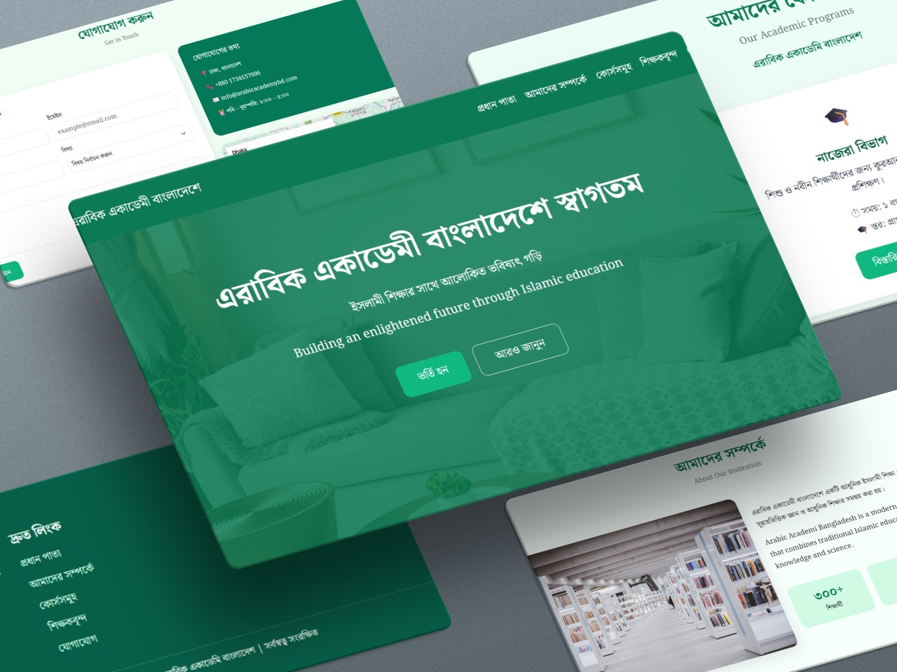

# "এরাবিক একাডেমী বাংলাদেশ" ওয়েবসাইট ল্যান্ডিং পেজ

আমি এরাবিক একাডেমী বাংলাদেশ ল্যান্ডিং পেজ ডিজাইন করেছি। এই ওয়েব ডিজাইনে আমি যেসব টেকনোলজি ব্যবহার করেছি তা হলোঃ

* HTML 5
* CSS 3
* Bootstrap 5

## Project Sections

এই ল্যান্ডিং পেজ প্রজেক্টে যেসব সেকশন আছে, তা হলোঃ

* Header
* Hero Section
* About Section
* Course Section
* Teachers Section
* Contact Section
* Footer Section

----

## আমার সাথে যোগাযোগ

🔗 [Linked In](https://www.linkedin.com/in/rs-riazul-islam-400a5a39a)
🔗 [GitHub](https://github.com/rsriazulislam0-source)
🔗 [Facebook](https://www.facebook.com/rs.riaz.amin)
📞 01313295777
